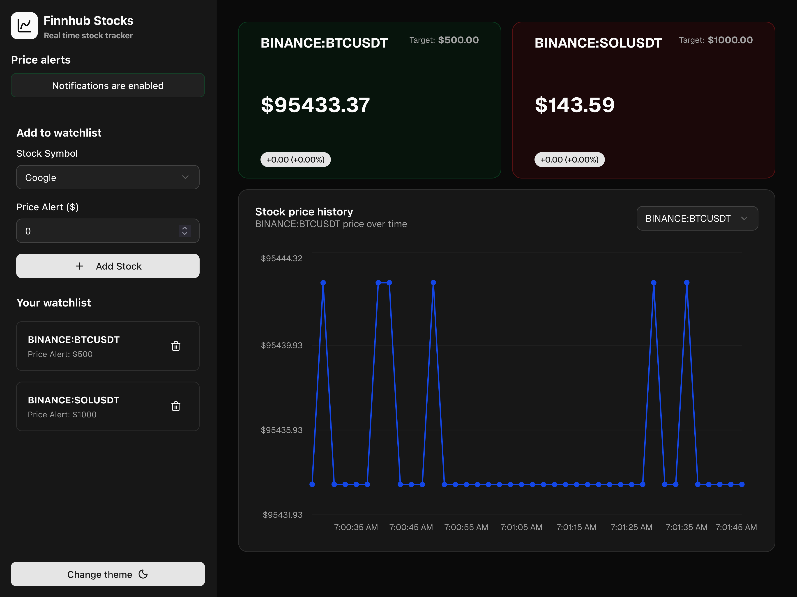
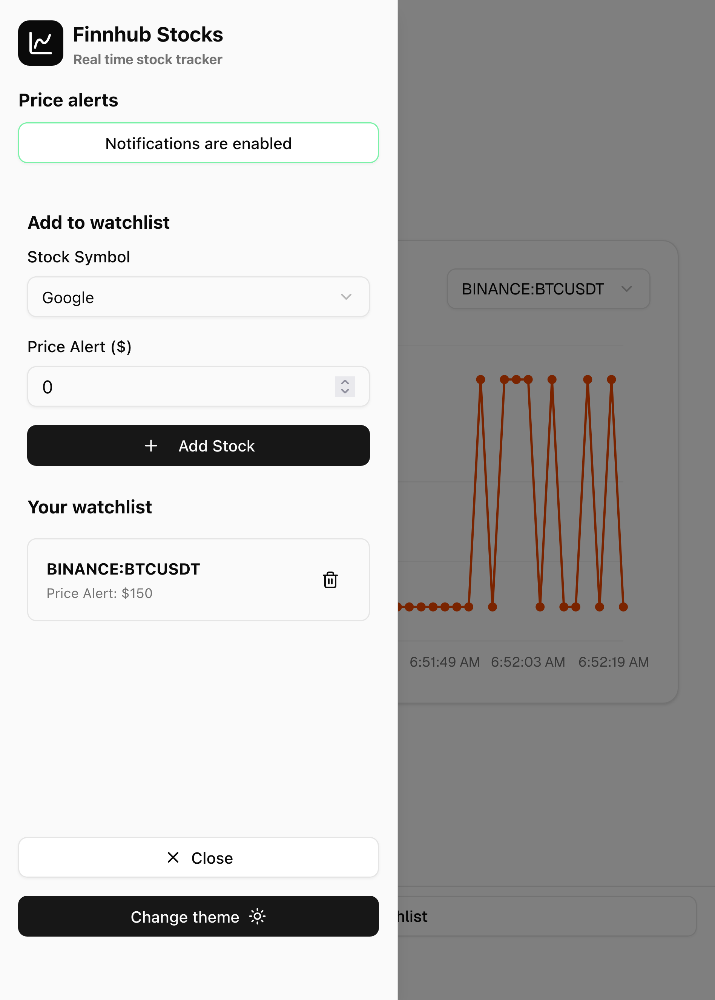

# Finnhub Stocks Tracker

A real-time stock tracking application built with Next.js, featuring live updates via WebSockets, offline persistence, and push notifications.

## 💻 Live Demo

Check out the live site: [Finnhub Stocks Tracker](https://finnhub-stock-tracker.vercel.app/).

The app is published with Vercel.

## 📷 Screenshots

|                      Desktop                       |                       Mobile                       |
| :------------------------------------------------: | :------------------------------------------------: |
|  |  |

## 🚀 Features

- **Real-time Updates**: Live stock price streaming utiliznig the Finnhub Trades WebSocket.
- **Stock Watchlist**: Add and remove stocks from your personal watchlist. Select through 6 available stocks and 3 cryptocurrencies.
- **Price Alerts**: Set custom price alerts for each stock.
- **Push Notifications**: Receive browser notifications when a stock price drops below your alert price.
- **Offline Support**: Data persistence using Dexie.js and PWA capabilities.
- **Interactive Charts**: Visual representation of price history using Recharts.
- **Responsive Design**: Fully responsive UI built with Tailwind CSS and Shadcn UI.
- **Dark Mode**: Support for light and dark themes.

## 🛠️ Tech Stack

- **Framework & Language**: Next.js 15+ with Typescript
- **State Management**: Zustand
- **Database/Persistence**: Dexie.js (IndexedDB wrapper)
- **Styling**: Tailwind CSS & Shadcn UI
- **Charts**: Rechartsand Shadcn UI Charts
- **Real-time Data**: Finnhub API(https://finnhub.io/) (WebSockets)
- **Notifications**: Web Push API
- **Forms**: React Hook Form & Zod

### Dev tools

- **Husky**: Git hooks for linting and commits message validation
- **Commitlin**: Makes sure commits messgaes are well formatted
- **Eslint & Prettier**: Code quality and formatting

Husky runs automatically when a commit is changed, formatting the modified changes.

## 🏗️ Architecture

The project follows a modular architecture inspired by Domain-Driven Design principles to ensure maintainability and scalability:

- **`src/modules/stocks/domain`**: Contains core business logic, entities (`Stock`, `Trade`) and repository interfaces.
- **`src/modules/stocks/infrastructure`**: Implements external concerns like data persistence and external API communication.
- **`src/modules/stocks/presentation`**: Contains UI components, hooks, and state management logic.
- **`src/modules/shared`**: Reusable UI components (Shadcn), utility functions, and common hooks.

## 🚦 Getting Started

### Prerequisites

- Node.js 18+
- pnpm (recommended) or npm/yarn
- A Finnhub API Key (Get one for free at [finnhub.io](https://finnhub.io/))

### Environment Variables

Create a `.env.local` file in the root directory and add the following:

```env
NEXT_PUBLIC_FINNHUB_API_KEY=your_finnhub_api_key
NEXT_PUBLIC_VAPID_PUBLIC_KEY=your_vapid_public_key
VAPID_PRIVATE_KEY=your_vapid_private_key
NEXT_PUBLIC_PERSONAL_VAPID_EMAIL=your_email@example.com
```

Note: VAPID keys are required for Push Notifications. You can generate them using `web-push generate-vapid-keys`.

### Installation

1. Clone the repository:

   ```bash
   git clone https://github.com/your-username/finnhub-stock-tracker.git
   cd finnhub-stock-tracker
   ```

2. Install dependencies:

   ```bash
   pnpm install
   ```

3. Run the development server:

   ```bash
   pnpm dev
   ```

4. Open [http://localhost:3000](http://localhost:3000) in your browser.

## 📱 PWA & Notifications

To test PWA features and Push Notifications locally:

1. Run the server with HTTPS:
   ```bash
   pnpm dev:pwa
   ```
2. Enable notifications when prompted by the application.
3. Set a price alert higher than the current price to trigger a notification (the app checks for prices dropping _below_ the alert).
4. Open [https://localhost:3000](https://localhost:3000) in your browser.
